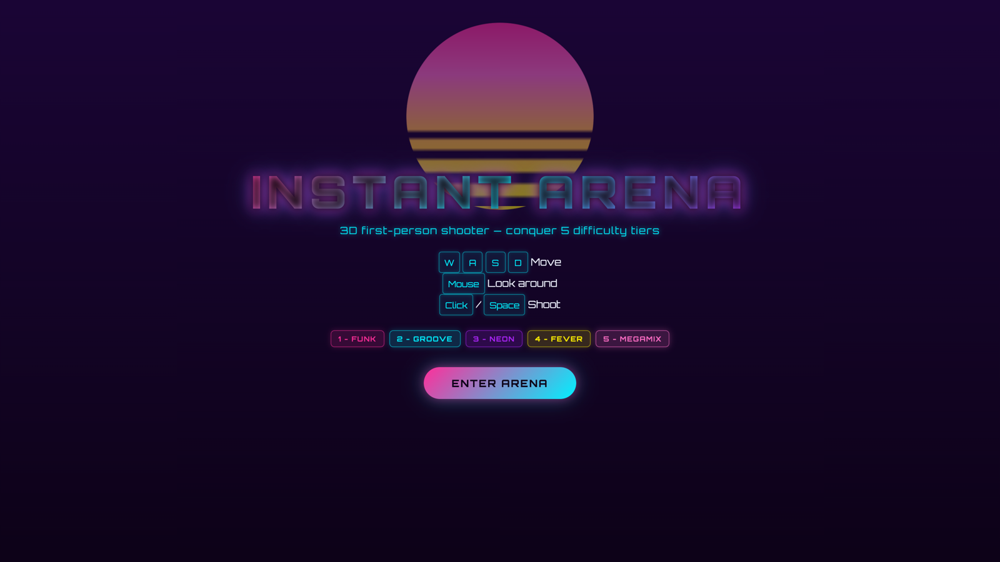
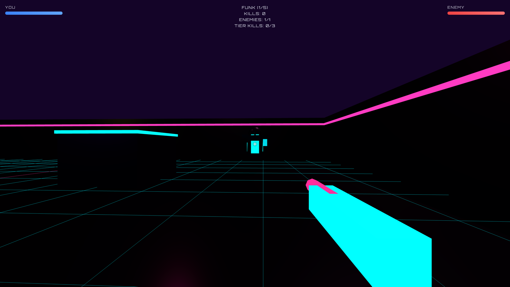
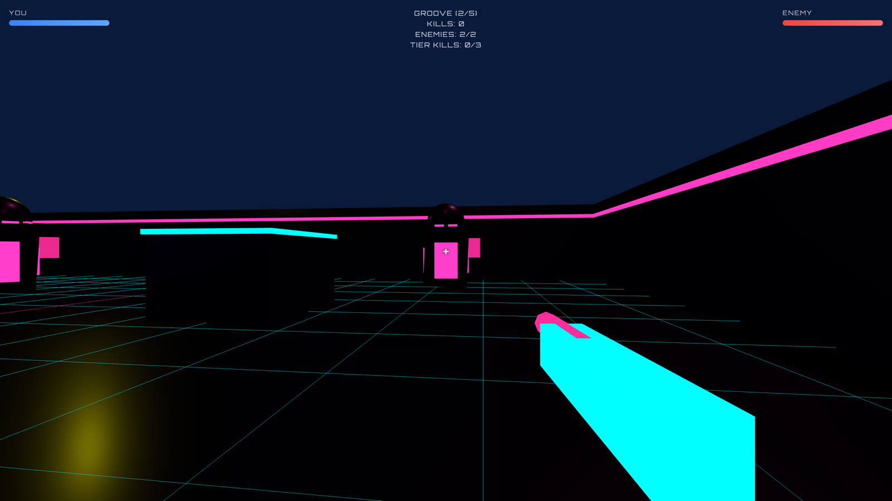
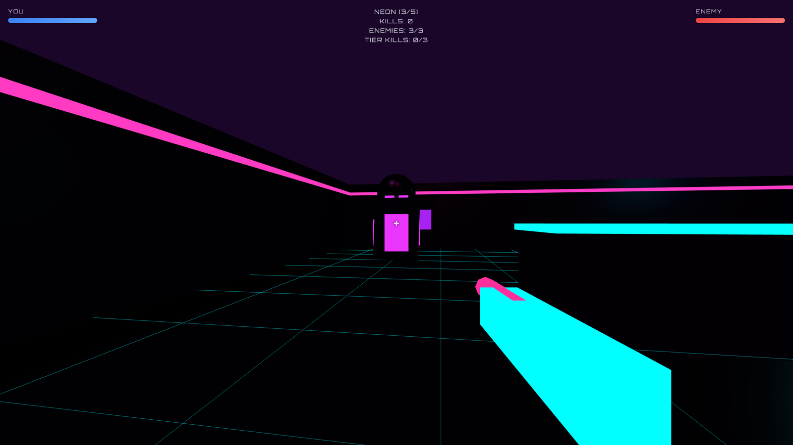
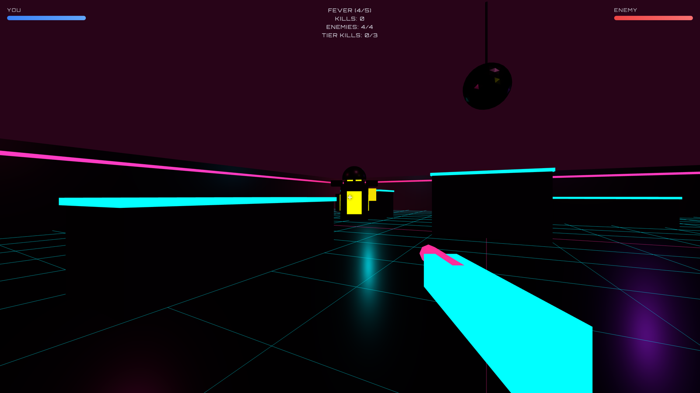
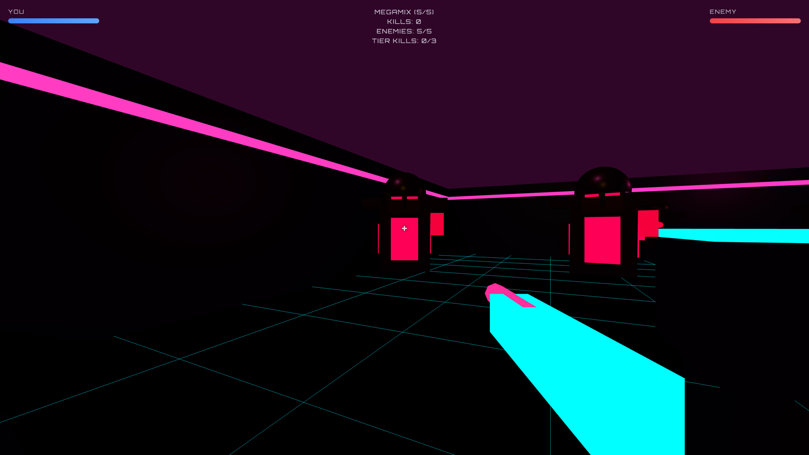
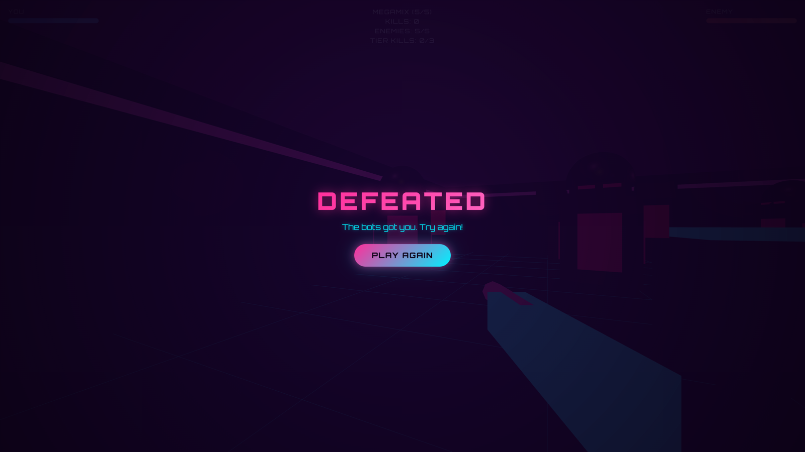

# Arena Shooter

3D first-person arena shooter in the browser. Conquer 5 difficulty tiers with escalating enemies, a retro 80s disco arena, and a procedural synthwave soundtrack.



## Screenshots

### Tier progression — cool to hot

Each tier shifts the enemy neon palette and the arena lighting, and raises the music tempo.


*Cyan enemies · magenta/cyan lights · 120 BPM.*


*Magenta enemies · 125 BPM.*


*Purple enemies · 130 BPM.*


*Yellow/pink enemies · 135 BPM.*


*Hot pink enemies · 140 BPM — the climax.*

### Victory


### Game over



## Features

- **5 difficulty tiers** with unique names, neon palettes, and tempos
- **Neon-rainbow enemies** — cyan → magenta → purple → yellow → hot pink as you climb the tiers
- **Escalating enemy count** — 1 to 5 enemies on screen per tier
- **Retro 80s disco arena** — neon grid floor, mirror disco ball, four orbiting colored lights
- **Dynamic arena lighting** that shifts with each tier
- **Procedural synthwave soundtrack** — four-on-the-floor beat with per-tier tempo and key
- **Gunshot, hit, and pickup sound effects** via Web Audio API
- **Win condition** — beat all 5 tiers to trigger the victory animation
- **Health pickups** drop from defeated enemies
- **WASD + mouse** controls

## Difficulty tiers

| Tier | Name | Enemies | Enemy accent | Tempo |
|------|------|---------|--------------|-------|
| 1 | Funk | 1 | Cyan | 120 BPM |
| 2 | Groove | 2 | Magenta | 125 BPM |
| 3 | Neon | 3 | Purple | 130 BPM |
| 4 | Fever | 4 | Yellow | 135 BPM |
| 5 | Megamix | 5 | Hot pink | 140 BPM |

## Quick start

```bash
just setup   # install tools + dependencies
just run     # start the dev server (open the URL it prints)
```

Then click **Enter Arena** and play.

## Controls

| Key | Action |
|-----|--------|
| W/A/S/D | Move |
| Mouse | Look around |
| Click / Space | Shoot |

## Build

```bash
just build
just preview   # serve production build locally
```

## Stack

- [Three.js](https://threejs.org/) — 3D rendering in the browser
- [Vite](https://vite.dev/) — fast dev server and bundler
- Web Audio API — procedural soundtrack and sound effects

No backend required. Everything runs client-side.
