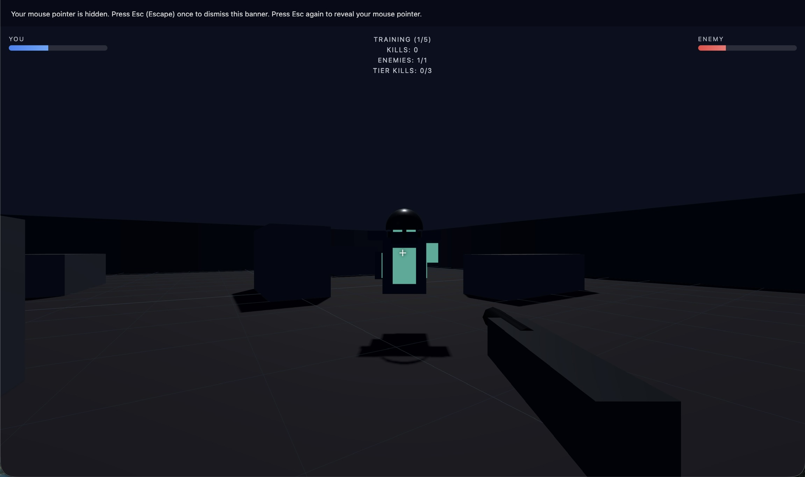
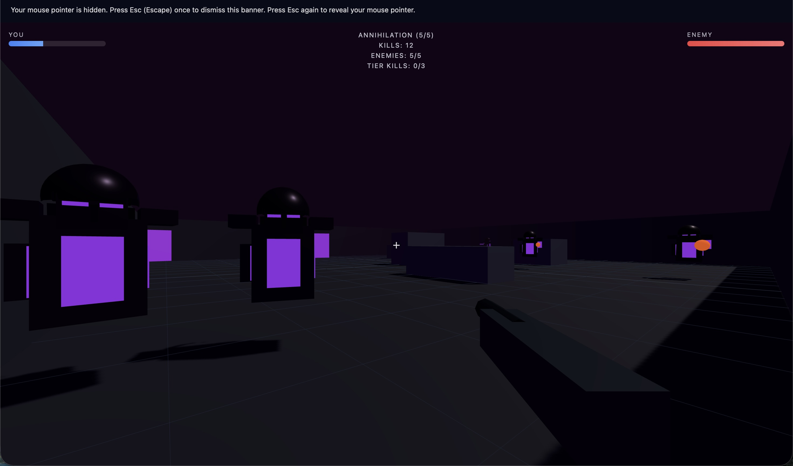
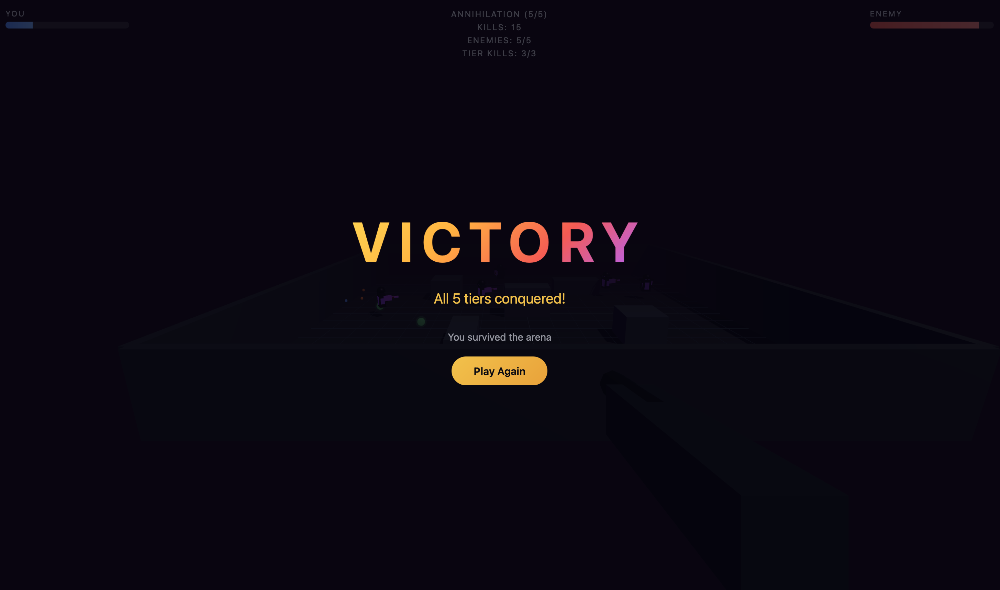

# Instant Arena Shooter

3D first-person arena shooter in the browser. Conquer 5 difficulty tiers with escalating enemies, dynamic lighting, and procedural soundtracks.

## Screenshots

### Training Tier



### Annihilation Tier



### Victory Screen



## Features

- **5 difficulty tiers** with unique names, colors, and soundtracks
- **Friendly to aggressive** visual scaling - enemies shift from blue/green to red/purple
- **Multi-eniculty** spawning - 1 to 5 enemies per tier
- **Dynamic arena lighting** that changes with each tier
- **Procedural audio** - different ambient soundtracks per difficulty
- **Gunshot and hit sound effects** via Web Audio API
- **Win condition** - beat all 5 tiers to see the victory animation
- **Health pickups** drop from defeated enemies
- **WASD + mouse** controls

## Difficulty Tiers

| Tier | Name | Enemies | Color Theme | Music |
|------|------|---------|-------------|-------|
| 1 | Training | 1 | Blue/Green | Calm, friendly |
| 2 | Patrol | 2 | Yellow/Orange | Slightly tense |
| 3 | Assault | 3 | Orange/Red | Intense, driving |
| 4 | Warzone | 4 | Red/Dark | Aggressive |
| 5 | Annihilation | 5 | Purple/Crimson | Extreme, menacing |

## Quick start

```bash
just setup   # install tools + dependencies
just run     # start the dev server (open the URL it prints)
```

Then click **Enter Arena** and play.

## Controls

| Key | Action |
|-----|--------|
| W/A/S/D | Move |
| Mouse | Look around |
| Click / Space | Shoot |

## Build

```bash
just build
just preview   # serve production build locally
```

## Stack

- [Three.js](https://threejs.org/) — 3D rendering in the browser
- [Vite](https://vite.dev/) — fast dev server and bundler
- Web Audio API — procedural soundtracks and sound effects

No backend required. Everything runs client-side.
